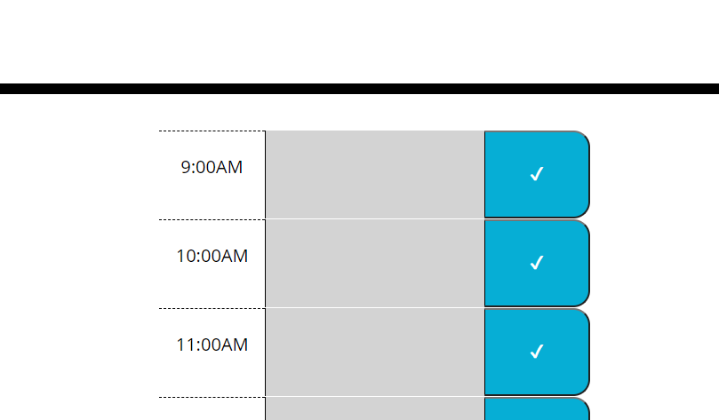

# work-day-scheduler
Homework Week 5

## Table of Contents

1. Installation
2. Usage
3. Images
4. Credits
5. License
6. URL 

## Installation

Clone with SSH Key:
git@github.com:cwf1984/work-day-scheduler.git

Or use the URL listed below to pull up the live. 

## Usage

* The current date displays at the top of the page
* There are timeblocks for each hour between 9AM and 5PM
* Time blocks are supposed to be color coded based on whether it is the past, present or future time - this was not working at my time blocks are not taking up the correct amount of space (???)
* I am struggling to get anything to show up in local storage 

## Images

Below is an image to demonstrate that the textarea is not following the column layout I am trying to set up in the HTML file using Bootstrap:

Below is an image of the code used for the textarea in the HTML file:

## Credits

As I have said with each preceding homework assignment, I want to thank Bootcamp Spot, the University of Washington and Trilogy Eduction for the assignment and code they provided. This assignment was very challenging, I am not quite there yet but it has been great practice. Thank you to the instructor and TA's for their dedication and patience. I also want to give thanks to my tutor, Zach Auerbach, for his dedication and help.

## License

MIT License

Copyright (c) [2020] [Vanessa B]

Permission is hereby granted, free of charge, to any person obtaining a copy
of this software and associated documentation files (the "Software"), to deal
in the Software without restriction, including without limitation the rights
to use, copy, modify, merge, publish, distribute, sublicense, and/or sell
copies of the Software, and to permit persons to whom the Software is
furnished to do so, subject to the following conditions:

The above copyright notice and this permission notice shall be included in all
copies or substantial portions of the Software.

THE SOFTWARE IS PROVIDED "AS IS", WITHOUT WARRANTY OF ANY KIND, EXPRESS OR
IMPLIED, INCLUDING BUT NOT LIMITED TO THE WARRANTIES OF MERCHANTABILITY,
FITNESS FOR A PARTICULAR PURPOSE AND NONINFRINGEMENT. IN NO EVENT SHALL THE
AUTHORS OR COPYRIGHT HOLDERS BE LIABLE FOR ANY CLAIM, DAMAGES OR OTHER
LIABILITY, WHETHER IN AN ACTION OF CONTRACT, TORT OR OTHERWISE, ARISING FROM,
OUT OF OR IN CONNECTION WITH THE SOFTWARE OR THE USE OR OTHER DEALINGS IN THE
SOFTWARE.

## URL
https://cwf1984.github.io/work-day-scheduler/
